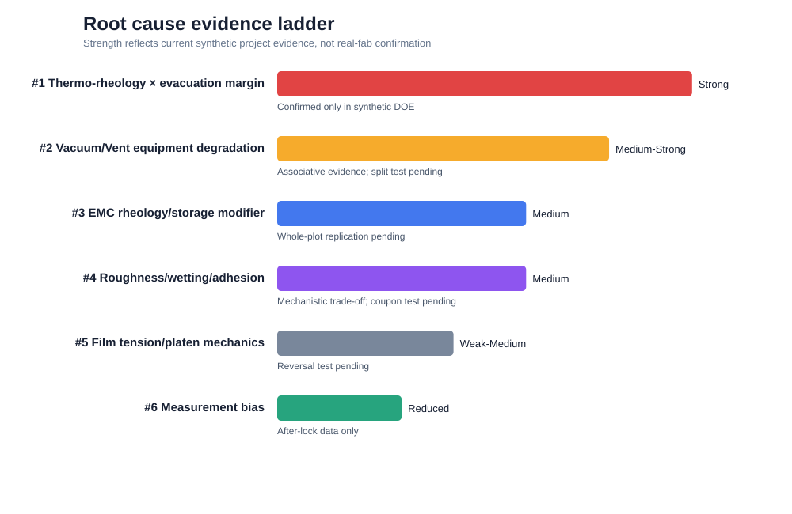
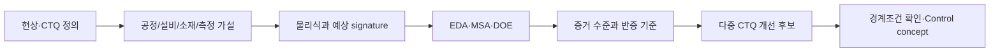

# Semiconductor Package & Test Engineering Portfolio

기계공학의 **열역학·유체역학·접촉/표면공학**을 데이터 분석, DOE, MSA와 결합해 반도체 후공정 불량을 규명하는 포트폴리오입니다. 목표는 모델 정확도가 아니라 다음 질문에 답하는 것입니다.

> 어떤 물리적 메커니즘으로 불량이 발생했고, 공정·설비·소재·측정 중 무엇을 어떻게 검증하고 바꿔야 하는가?

## Completed project

### Project 1 — Compression Molding Edge Void & Chip Offset

재구성 웨이퍼의 edge void와 방향성 chip offset을 하나의 **열–유동–경화 및 힘 평형 문제**로 연결했습니다. 공개 문헌에서 물리 구조를 세우고, physics-informed synthetic dataset으로 경쟁 가설을 비교한 뒤 MSA uncertainty를 포함한 robust process window와 confirmation scenario를 설계했습니다.

[](project_01_molding/report/A3_report.md)

핵심 결과:

- 대표 공정 지표: `M_process = t_gel − t_vac − t_fill`
- 기계적 shift 지표: `SF_shift = F_hold / (F_drag + F_film + F_pressure_asymmetry)`
- 주가설 H1: heater-zone 불균일과 evacuation margin 감소가 EMC usable flow window를 축소 — synthetic DOE에서 **Strong**
- 설비가설 H2: vacuum/vent 열화 — 관측 signature는 **Medium–Strong**, 직접 split test 전에는 확정 보류
- 표면가설 H3: roughness가 wetting과 holding shear를 동시에 바꾸는 modifier — **Medium**, coupon replication 필요
- 개선 후보: M02/Smooth, 4.5 kPa abs, zone range 1.5°C, closing speed 0.85 mm/s
- 12회 synthetic confirmation: Edge Void 1.77% → 0.40%, Offset P95 41.1 → 16.7 μm
- 단, 이는 실제 Fab 수율 개선 실적이나 SK하이닉스 recipe가 아니라 **프로젝트 시나리오 내부의 검증 결과**입니다.

프로젝트 보기:

- [Project README](project_01_molding/README.md)
- [A3 engineering report](project_01_molding/report/A3_report.md)
- [물리식·논문·Kaggle·GitHub 근거](project_01_molding/report/04_engineering_literature_basis.md)
- [재현 notebook](project_01_molding/notebooks/06_confirmation.ipynb)
- [면접 설명 및 직무 연결 답변](project_01_molding/report/interview_summary.md)
- [자기소개서 100·300·500자 초안](project_01_molding/report/cover_letter_summaries.md)

## Engineering workflow



## Portfolio roadmap

| Project | Engineering theme | Status |
|---|---|---|
| 1. Compression Molding | Edge void, chip offset, thermo-rheology, vacuum, roughness | **Complete — synthetic study** |
| 2. Dicing | Cutting force, vibration, brittle chipping, takt | Planned |
| 3. Package Warpage | Multilayer thermo-mechanics, FEA/analytical model | Planned |
| 4. HBM/TIM Thermal | Thermal resistance, hotspot, BLT/void trade-off | Planned |
| 5. Solder Joint Life | CTE mismatch, inelastic strain, fatigue/Weibull | Planned |
| 6. Final Test False Fail | Socket/contact/temperature vs device failure | Planned |

완료하지 않은 프로젝트를 수행 실적으로 표시하지 않습니다.

## Data and claim boundary

> 본 데이터는 공개 문헌과 공정 메커니즘을 참고하여 프로젝트 검증 목적으로 생성한 synthetic engineering dataset이다.

- 실제 SK하이닉스 또는 다른 Fab의 데이터·recipe·규격을 사용하지 않았습니다.
- 수치는 `Engineering Target`과 project scenario이며 업계 표준값으로 주장하지 않습니다.
- Kaggle/GitHub 자료는 공간 데이터 표현과 분석 파이프라인 참고용이고, root cause 근거는 peer-reviewed mechanism과 프로젝트 검증에서 분리해 다룹니다.
- 실제 적용 전에는 제품별 material property, 장비 trace, chamber/material block confirmation 및 requalification이 필요합니다.

## Reproduce

Windows PowerShell 예시:

```powershell
cd "project_01_molding"
python -m venv .venv
.\.venv\Scripts\Activate.ps1
python -m pip install -r requirements.txt
python src\generate_data.py
python src\preprocess.py
python src\analysis.py
python src\visualization.py
python src\design_doe.py
python src\simulate_doe.py
python src\analyze_doe.py
python src\visualize_doe.py
python src\generate_msa.py
python src\analyze_msa.py
python src\visualize_msa.py
python src\verify_root_cause.py
python src\visualize_verification.py
python src\confirm_improvement.py
python src\visualize_confirmation.py
```

GitHub가 처음이라면 [초보자용 업로드·수정 가이드](project_01_molding/report/github_beginner_guide.md)를 먼저 읽어주세요.
