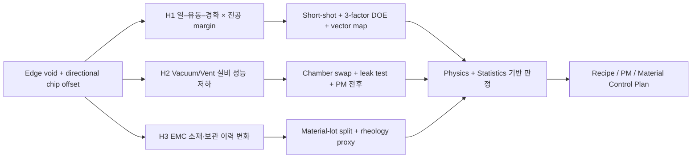

# PROJECT 1 · STEP 1 — Problem Definition과 공학적 문제 제기

## 1. 포트폴리오용 한 문장 문제 정의

> Wafer-level compression molding에서 edge void와 방향성을 가진 chip offset이 함께 증가한 현상을 발견하고, 이를 **EMC의 온도 의존 점도·경화 반응과 vacuum/vent 성능이 결합된 열–유동–경화 문제**로 정의한다. 장비 단독 원인과 소재 단독 원인을 경쟁 가설로 두고 공간 pattern, equipment trace, material genealogy와 DOE를 통해 원인을 판별한다.

이 문장은 “AI로 불량을 예측했다”가 아니라 **현상 → 물리 질문 → 비교 가설 → 검증 방법 → 공정 조치**의 흐름을 보여준다.

---

## 2. 왜 이 관점을 가장 추천하는가

### 추천 관점: 비등온 EMC 유동과 경화, 진공의 Coupled Process Window

Compression molding 중 EMC의 점도는 온도 상승에 따라 처음에는 낮아져 유동성이 좋아지지만, 경화가 진행되면 다시 빠르게 증가한다. 따라서 “온도가 높을수록 충전이 좋아진다”는 단순 관계가 아니다. 실제 충전 가능 시간은 다음 세 시간척도의 경쟁으로 볼 수 있다.

- `t_vac`: cavity가 필요한 진공 수준에 도달하는 시간
- `t_fill`: EMC가 edge까지 충전되는 시간
- `t_gel`: EMC가 유동성을 잃기 시작하는 시간

안전한 공정창의 개념 조건은 `t_vac < t_fill < t_gel`이다. Edge 온도 편차, vacuum 지연 또는 빠른 mold closing으로 이 순서가 무너지면 flow front가 기체를 가둔 채 닫히고 edge void가 남을 수 있다. 동시에 비대칭 pressure gradient와 viscous drag가 die에 횡력을 가하면 chip offset vector가 특정 방향으로 정렬될 수 있다.

개념적으로는 다음 연결을 사용한다.

```text
Edge temperature / cure history
            ↓
EMC viscosity μ(T, α) and gel time
            ↓
Flow-front velocity and pressure gradient ∇p
            ↓
Air evacuation margin + die drag force
            ↓
Edge void + directional chip offset
```

- `T`: 온도
- `α`: cure conversion
- die에 작용하는 유동력의 단순 표현: `F_drag ≈ Δp·A_projected + τ·A_wetted`
- 포획 기체의 1차 점검: 압축 전후 `P·V` 관계와 leak/outgassing 여부

정밀 CAE 수치가 아니라 **원인 방향과 필요한 센서를 정하는 engineering model**로 사용한다.

### Package & Test 양산기술 직무와의 연결

이 관점은 다음 역량을 한 프로젝트에서 동시에 보여준다.

1. **기계공학:** 열전달, 점성 유동, 압력 구배, 열팽창·수축, 접착 경계조건
2. **공정기술:** vacuum–temperature–closing speed의 공정창과 DOE
3. **설비기술:** pump-down trace, leak-up, vent 상태, heater-zone 편차와 PM 이력
4. **양산기술:** chamber matching, material genealogy, side effect, SPC와 OCAP
5. **데이터 활용:** 공간 회귀, mixed-effects model, change point, trace feature 분석

---

## 3. Project Scenario의 현상과 CTQ

아래 숫자는 실제 Fab 또는 업계 규격이 아니다. 이후 synthetic dataset과 검증 설계를 일관되게 만들기 위한 **본 프로젝트 분석용 Engineering Target**이다.

### 현상

- wafer center보다 outer edge band에서 void가 집중된다.
- chip offset vector가 random 방향이 아니라 한쪽 또는 radial 방향으로 정렬되는 wafer가 증가한다.
- 두 현상이 모든 wafer에서 동일하지 않고 특정 chamber, 시간대, EMC genealogy와 연관될 가능성이 있다.

### Y / CTQ 정의

| 구분 | CTQ | 정의 | Scenario 현재 수준 | Engineering Target | Scenario USL/관리 기준 |
|---|---|---|---:|---:|---:|
| 대표 Y | Edge Void Area Ratio | outer 10% radial band의 검사 면적 대비 void 면적 | 1.8% | ≤ 0.50% | 1.00% |
| 동시 Primary CTQ | Chip Offset P95 | wafer 내 `sqrt(dx²+dy²)`의 95 percentile | 42 μm | ≤ 20 μm | 30 μm |
| Secondary CTQ | Warpage P95 | room-temperature global bow의 lot P95 | 920 μm | ≤ 750 μm | 1,000 μm |
| 생산성 CTQ | Mold Cycle Time | load-to-unload cycle time | index 100 | ≤ 105 | 110 |

LSL은 네 CTQ 모두 품질상 의미가 없으므로 설정하지 않는다. Cycle time은 장비마다 절대 시간이 다르다는 가정하에 baseline을 100으로 정규화한다.

### 개선 성공 기준

1. Edge Void Area Ratio와 Chip Offset P95가 동시에 Target을 만족한다.
2. Warpage P95가 악화되지 않고 Cycle Time index가 105 이내다.
3. 개선 효과가 특정 lot에만 나타나지 않고 material lot과 chamber를 block한 verification run에서 재현된다.
4. 평균뿐 아니라 P95, 표준편차, defect rate와 process capability를 함께 비교한다.

---

## 4. 경쟁 가설 3개



### H1 — 추천: 열–유동–경화와 진공 margin의 상호작용

**원인**  
Edge heater-zone 편차 또는 열이력 변화로 EMC viscosity/gel timing이 변하고, 한계 상태의 vacuum evacuation 및 compression profile과 상호작용한다.

**물리적 메커니즘**  
비등온 유동과 cure 진행으로 edge flow resistance가 증가한다. Vacuum이 충분히 형성되기 전에 flow front가 닫히면 잔류 기체가 edge에 포획된다. 비대칭 pressure gradient와 shear drag는 die를 같은 방향으로 이동시킨다.

**예상 Data Signature**

- void가 edge distance에 비선형적으로 증가
- void 위치와 chip offset vector 방향이 공간적으로 연결
- `vacuum margin = t_gel_proxy − t_vac`가 작을수록 두 CTQ 동시 악화
- zone temperature deviation × pump-down time 또는 closing speed interaction이 유의
- 평균 temperature보다 waveform overshoot와 zone range가 설명력이 큼

**필요 데이터**  
Zone별 temperature/pressure/vacuum/position waveform, die별 초기·mold 직후·debond 후 좌표, void map, recipe revision, cure/gel proxy.

**검증 방법**

1. Short-shot 조건을 이용해 flow-front 비대칭을 비교한다.
2. `vacuum quality × closing speed × edge-zone temperature`의 소규모 DOE를 material lot block으로 수행한다.
3. chamber와 lot을 random effect로 둔 mixed-effects regression으로 interaction을 검증한다.
4. void map과 chip offset vector field의 방향 일치도를 비교한다.

**가설이 맞다면 개선할 Parameter**

- vacuum 도달 확인 후 compression을 시작하는 interlock
- evacuation time/profile과 staged closing speed
- edge/center heater-zone matching 및 overshoot 제한
- cure 전 usable flow window 안에서 preheat/hold profile 조정

모든 숫자는 DOE 후 project scenario recipe로 결정하며, 현 단계에서 생산 조건으로 단정하지 않는다.

**기각 기준**  
Temperature/vacuum/closing profile을 독립적으로 교정해도 CTQ가 변하지 않고, 공간 방향성이나 interaction이 재현되지 않는다.

**개선 시도와 Side Effect**

- evacuation 연장 → void 개선 가능, 그러나 cycle time 증가
- closing speed 저감 → drag 감소 가능, 그러나 takt와 cure timing 변화
- edge-zone 온도 보정 → viscosity 균일화 가능, 그러나 cure 부족 또는 warpage 변화
- 따라서 void만 최적화하지 않고 chip offset, warpage, cycle time을 동시 response로 둔다.

---

### H2 — 다른 가능성 1: Vacuum/Vent 설비 성능 저하

**원인**  
Vent 오염, seal 누설, pump 성능 저하 또는 chamber별 배관 conductance 차이 때문에 설정값과 실제 cavity evacuation 성능이 달라진다.

**물리적 메커니즘**  
잔류 공기와 volatile이 edge 방향으로 빠져나가지 못하고 최종 충전부에 포획된다. 비대칭 vent 막힘이면 pressure distribution도 비대칭이 되어 chip offset 방향성이 생길 수 있다.

**예상 Data Signature**

- 특정 equipment/chamber에서 반복
- pump-down time 증가, base pressure 악화, leak-up slope 증가
- vent cleaning 또는 seal/pump PM 직후 step recovery
- EMC lot을 바꿔도 chamber 차이가 유지

**판별 시도**

1. 빈 cavity 또는 reference setup으로 pump-down/leak-rate test
2. 정상·의심 chamber의 동일 recipe/동일 EMC lot split run
3. vent cleaning 전후 paired comparison
4. alarm 평균이 아니라 raw vacuum trace의 slope, settling, integral 특징 비교

**개선 접근**

- vent cleaning을 고정 주기뿐 아니라 pump-down degradation 기반으로 실행
- seal/pump/line별 leak isolation과 chamber matching
- recipe setpoint 대신 actual base pressure와 도달시간 interlock
- PM 후 golden-wafer requalification

**기각 기준**  
Chamber swap과 PM 전후에도 defect pattern이 그대로 material lot을 따라가고 vacuum trace 차이가 없다.

---

### H3 — 다른 가능성 2: EMC 소재 유동성·보관 이력 변화

**원인**  
EMC lot 간 viscosity/gel time 차이, storage/floor-life exposure, moisture 또는 charge geometry 편차가 발생한다.

**물리적 메커니즘**  
높은 점도 또는 짧은 gel time은 filling resistance와 die drag를 키운다. 수분/volatile 또는 charge placement 편차는 void와 비대칭 flow를 악화시킬 수 있다.

**예상 Data Signature**

- 동일 EMC lot이 여러 chamber에서 같은 방향의 악화를 만듦
- storage/floor time 또는 incoming viscosity/gel proxy와 dose-response
- 정상 chamber에서도 suspect lot 투입 시 재현되고 lot 교체 후 회복
- equipment trace는 정상 범위지만 CTQ만 이동

**판별 시도**

1. 정상·의심 EMC lot을 동일 chamber에서 교차 split run
2. supplier CoA만 보지 않고 실제 viscosity-temperature/gel-time proxy 측정
3. storage, thaw/open, floor exposure, charge mass/placement genealogy 추적
4. material lot을 block으로 둔 DOE와 lot×temperature interaction 확인

**개선 접근**

- material exposure time과 storage history의 digital genealogy
- viscosity/gel proxy 기반 incoming 또는 periodic check
- FEFO와 허용 floor-life 관리, suspect lot hold/segregation
- charge mass와 placement poka-yoke

**기각 기준**  
여러 EMC lot에서 동일 chamber만 악화되고 material property/exposure와 CTQ의 관계가 재현되지 않는다.

---

## 5. 원인을 잘못 판단하지 않기 위한 Measurement Gate

Root Cause 분석 전에 “보이는 산포가 실제 공정 산포인가?”를 확인한다.

- 동일 wafer를 동일 장비에서 반복 SAM scan하여 repeatability 확인
- 다른 검사 장비/recipe/operator로 reproducibility 확인
- edge에서 image threshold와 resolution 때문에 void가 과대 판정되는지 확인
- molding 전후 coordinate registration residual과 stage drift 확인
- blind sample과 reference artifact로 tool bias 점검

측정시스템의 contribution이 허용되지 않을 정도로 크면 H1~H3 판정 전에 측정 recipe와 정합 알고리즘을 먼저 고친다.

---

## 6. 분석 및 개선 Roadmap

| 단계 | 질문 | 분석/실험 | 의사결정 |
|---|---|---|---|
| Pattern 확인 | Random인가, edge/chamber/time pattern인가? | wafer map, vector map, lot/chamber/time trend | 가설 우선순위 |
| Measurement 확인 | 실제 산포인가? | repeat scan, registration study, 간이 GR&R | 측정기인 제거 |
| Trace 분석 | 설정값과 실제 장비 거동이 같은가? | waveform feature, change point, PM overlay | H2 강화/기각 |
| Genealogy 분석 | EMC lot과 exposure를 따라가는가? | blocked ANOVA, mixed model | H3 강화/기각 |
| 물리 검증 | 열–진공–closing interaction인가? | short shot, factorial DOE, response surface | H1 인과 검증 |
| 최적화 | Primary CTQ와 side effect를 동시에 만족하는가? | desirability/process window | recipe 후보 |
| Verification | lot/chamber를 바꿔도 재현되는가? | before/after confirmation run | 양산 적용 판단 |
| Control | 다시 나빠질 때 무엇을 할 것인가? | SPC, interlock, PM/OCAP | 재발 방지 |

ML은 EDA와 공학 가설 이후 변수 중요도와 비선형 interaction을 확인하는 보조 수단으로만 사용한다. 모델 accuracy를 프로젝트 결론으로 사용하지 않는다.

---

## 7. 자기소개서에서의 표현 방향

### 문제 제기형 초안

> 패키징 부트캠프 프로젝트에서 compression molding의 edge void를 단순 진공 부족으로 단정하지 않고, EMC의 온도 의존 점도와 경화 시간, 장비의 실제 vacuum trace가 결합된 공정창 문제로 재정의했습니다. 특히 void map과 chip offset vector를 함께 분석해 동일한 비대칭 유동 메커니즘인지 확인하고, 장비 단독 원인과 EMC 소재 단독 원인을 경쟁 가설로 설정했습니다. 이후 chamber·material lot을 block한 DOE와 short-shot, leak test, 측정시스템 검증을 통해 원인을 좁히고, void뿐 아니라 warpage와 cycle time까지 관리하는 개선안을 설계하고자 했습니다.

아직 검증 전 단계이므로 “개선했다”가 아니라 **재정의했다, 가설을 세웠다, 검증을 설계했다**라고 표현한다. 이후 synthetic analysis가 끝나면 확인된 결과만 수치로 교체한다.

### 면접에서 강조할 차별점

- 열역학을 온도 하나의 상관분석이 아니라 `vacuum–fill–gel time` 경쟁으로 연결했다.
- 설비 설정값보다 actual waveform과 PM 회복 signature를 보았다.
- 공정기인/설비기인/소재기인을 swap·split·block 실험으로 구분했다.
- void 개선의 대가로 warpage 또는 takt가 나빠질 수 있어 다중 CTQ를 설정했다.
- AI는 root cause를 결정하지 않고 interaction 탐색과 후보 ranking을 보조하게 했다.

---

## 8. 다음 STEP의 검증 질문

STEP 2 EDA는 다음 순서로 진행한다.

1. Edge Void wafer map과 edge-distance profile에 pattern이 있는가?
2. Chip offset vector가 void가 집중된 방향과 일치하는가?
3. 특정 chamber 또는 PM age에서 동시에 증가하는가?
4. Raw vacuum/temperature trace의 변화가 CTQ보다 먼저 발생하는가?
5. 동일 EMC lot이 여러 chamber에서 재현되는가?

이 다섯 질문의 결과가 H1, H2, H3의 Evidence Level을 갱신한다.
