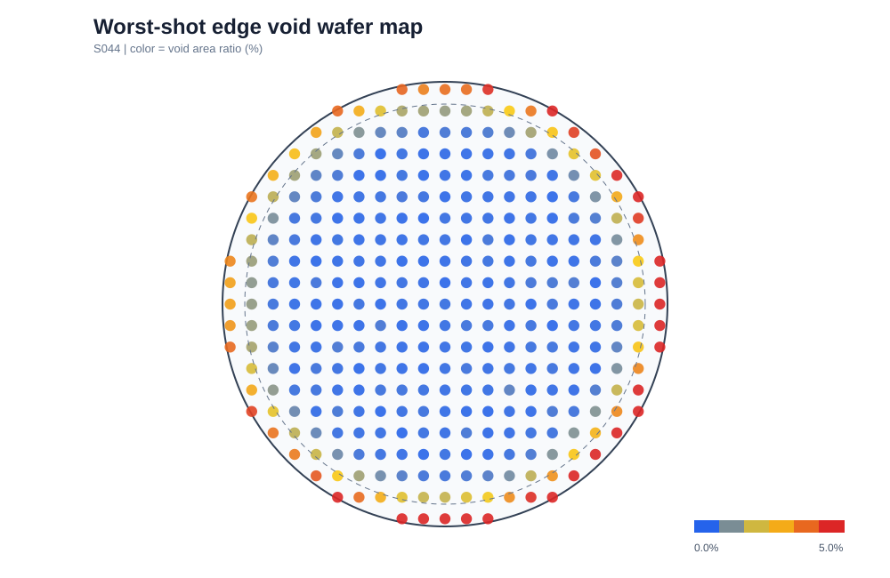
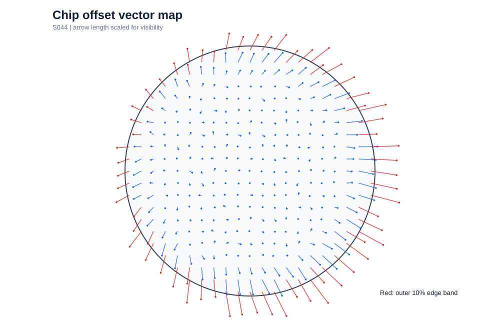
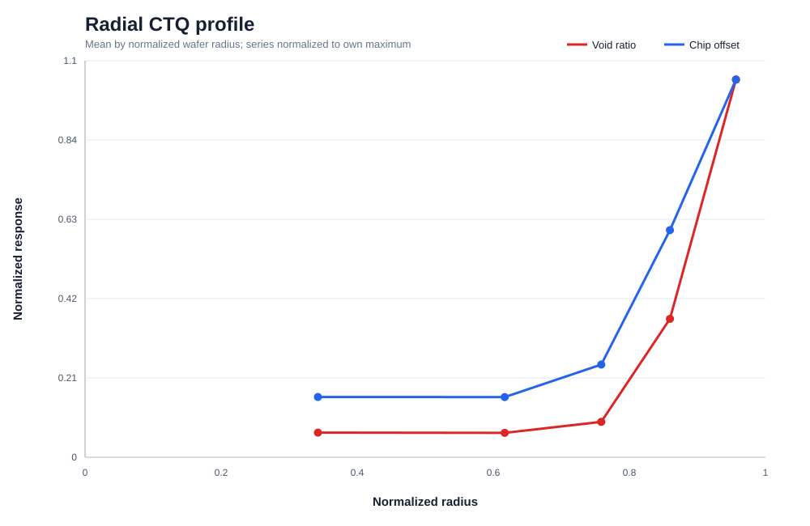
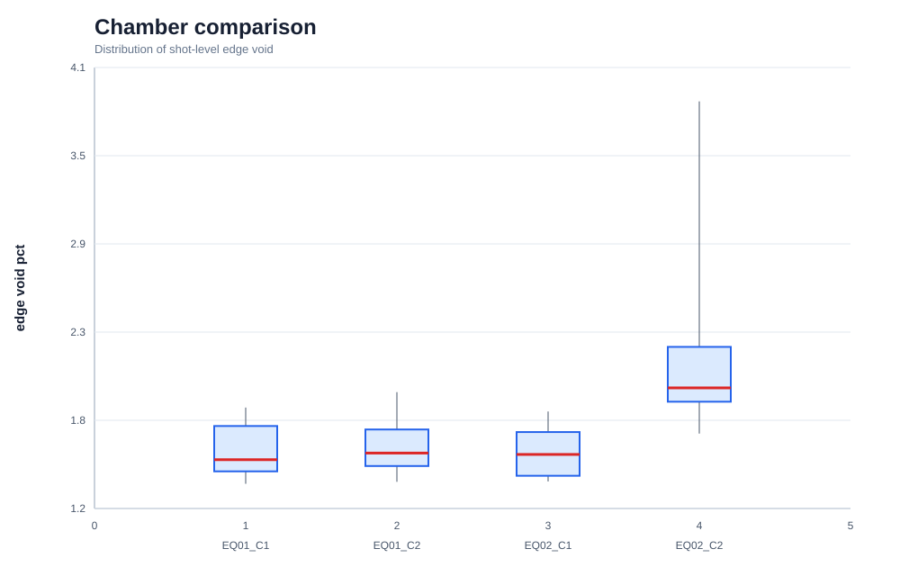
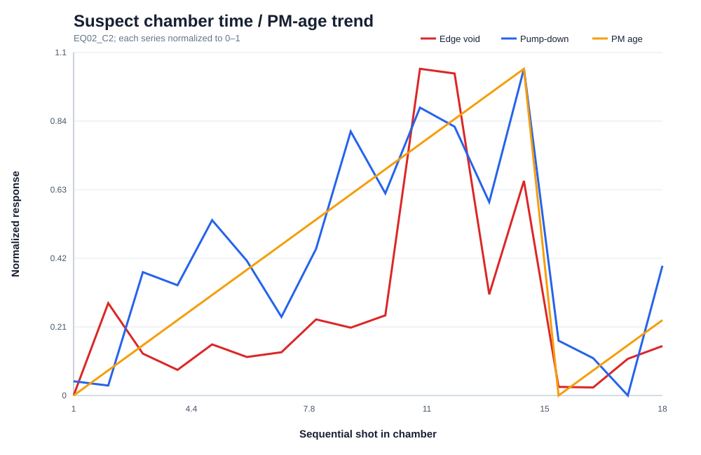
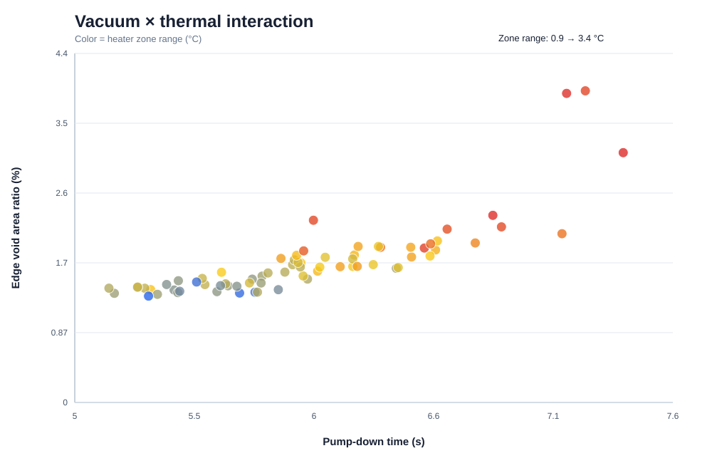
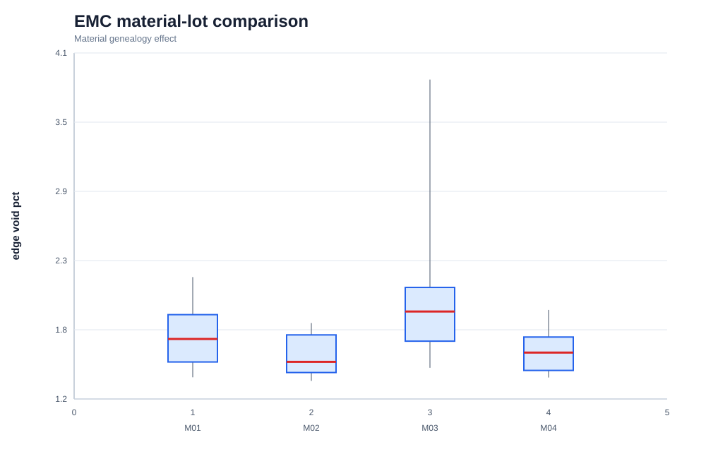
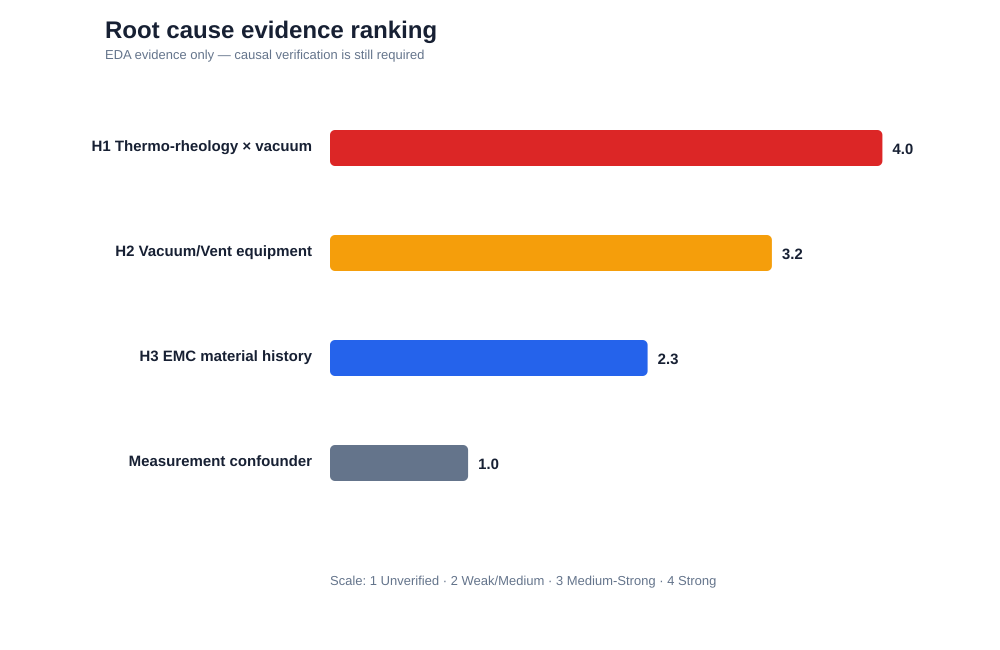

# PROJECT 1 · STEP 2 — EDA Findings

> **데이터 고지:** 본 데이터는 공개 문헌과 공정 메커니즘을 참고하여 프로젝트 검증 목적으로 생성한 synthetic engineering dataset이다. 아래 수치는 실제 Fab 성능이나 SK하이닉스 규격이 아니다.

## Executive Finding

불량은 random pattern보다 **edge 위치 + chamber/time drift + thermo-vacuum interaction**의 결합으로 설명되는 방향이 강하다. 현재 EDA evidence는 H1을 우선 검증 대상으로 올리지만 인과 확정은 아니다. H2는 H1의 설비 구성요인일 수 있고, H3는 process margin을 악화시키는 material modifier로 남는다.

### Scenario CTQ 현황

| CTQ | 현재 synthetic 수준 | STEP 1 Engineering Target | 판정 |
|---|---:|---:|---|
| Edge Void Area Ratio | 1.75% | ≤ 0.50% | Gap 존재 |
| Chip Offset P95 | 41.3 μm | ≤ 20 μm | Gap 존재 |
| Warpage P95 | 921 μm | ≤ 750 μm | Gap 존재 |
| Cycle Time Index P95 | 101.5 | ≤ 105 | Target 내 |

## Figure 1 — Worst-shot Edge Void Wafer Map

**Observation**  
Worst shot `S044`에서 void가 중심보다 외곽에 집중되고 특정 방위에서 더 크다. 전체 edge/center 평균 비는 7.6배다.

**Engineering Interpretation**  
완전 random contamination보다 마지막 충전부, vent 방향 또는 비대칭 flow front와 연결된 공간 메커니즘이 우선이다.

**Next Action**  
동일 shot의 chip offset vector 방향과 겹쳐 보고 short-shot에서 flow-front 형상을 확인한다.

## Figure 2 — Chip Offset Vector Map

**Observation**  
Worst shot의 edge die에서 offset vector 크기와 정렬성이 함께 증가한다. High-void die의 radial-direction alignment score는 0.94이다.

**Engineering Interpretation**  
위치만 이동한 registration error보다 pressure-gradient/viscous drag에 의한 실제 방향성 이동 가설과 정합적이다. 다만 mold 직후와 debond 후 좌표 분리가 필요하다.

**Next Action**  
단계별 좌표 측정과 metrology repeat scan으로 flow-induced shift와 apparent shift를 분리한다.

## Figure 3 — Radial Profile

**Observation**  
Void와 chip offset이 wafer 반경 90% 이후 급격히 증가한다.

**Engineering Interpretation**  
선형 전면 효과보다 edge band에서 evacuation/fill margin이 급격히 줄어드는 threshold형 현상 가능성이 높다.

**Next Action**  
edge distance를 연속 변수로 둔 piecewise regression과 edge-band 정의 민감도 분석을 수행한다.

## Figure 4 — Chamber Comparison

**Observation**  
Worst chamber는 `EQ02_C2`이며 chamber가 edge void 산포를 설명하는 η²는 0.38이다.

**Engineering Interpretation**  
설비/chamber 영향이 존재하지만 chamber가 zone range와 pump-down drift를 함께 가지므로 단순 chamber label을 root cause로 부르면 안 된다.

**Next Action**  
동일 EMC lot·recipe의 chamber split run과 vent cleaning 전후 paired comparison을 실시한다.

## Figure 5 — Time / PM-age Trend

**Observation**  
의심 chamber에서 vent PM age가 증가할수록 pump-down과 edge void가 함께 상승하고 PM reset 부근에서 회복되는 형태가 보인다.

**Engineering Interpretation**  
설비 열화 signature가 CTQ와 시간적으로 연결되며 H2 evidence를 높인다. 그러나 zone range도 함께 이동하므로 H1 interaction을 분리해야 한다.

**Next Action**  
PM 전후 golden-wafer requalification과 leak/pump-down test를 수행한다.

## Figure 6 — Vacuum × Thermal Interaction

**Observation**  
Pump-down이 길고 zone range가 큰 영역에서 edge void가 가장 높다. Process margin과 edge void의 상관은 -0.78이다.

**Engineering Interpretation**  
진공 또는 온도 하나보다 둘의 결합과 `t_gel − t_vac − t_fill` margin이 물리적으로 더 일관된 설명이다.

**Next Action**  
Material lot을 block한 `vacuum quality × closing speed × zone temperature` DOE로 인과성을 검증한다.

## Figure 7 — EMC Material Lot

**Observation**  
Worst material은 `M03`이고 viscosity index와 edge void 상관은 0.71이다.

**Engineering Interpretation**  
소재는 독립 root cause일 수도 있지만 thermo-vacuum margin을 좁히는 modifier일 가능성도 있다.

**Next Action**  
정상/의심 EMC lot을 동일 chamber에서 교차 투입하고 viscosity-temperature/gel-time proxy를 측정한다.

## Figure 8 — Root Cause Evidence Ranking

**Observation**  
현재 synthetic EDA에서는 H1 > H2 > H3 순이다.

**Engineering Interpretation**  
통계 상관만으로 H1을 확정하지 않는다. H2와 H3는 H1의 구성요인 또는 confounder일 수 있다.

**Next Action**  
STEP 3에서 각 가설의 검증 matrix, 예상 signature, 반증 기준과 DOE run order를 확정한다.

## 결론

- **Random인가 Pattern인가?** Pattern이다.
- **위치 의존성?** Edge 의존성이 강하다.
- **Equipment/Chamber 의존성?** 존재한다; `EQ02_C2` 우선 점검 대상이다.
- **Time Drift?** 의심 chamber의 PM age와 함께 나타난다.
- **Material Lot?** `M03`이 악화 방향이지만 단독 설명은 부족하다.
- **현 단계 Root Cause?** 확정하지 않는다. H1 Strong, H2 Medium-Strong, H3 Medium으로 업데이트한다.
