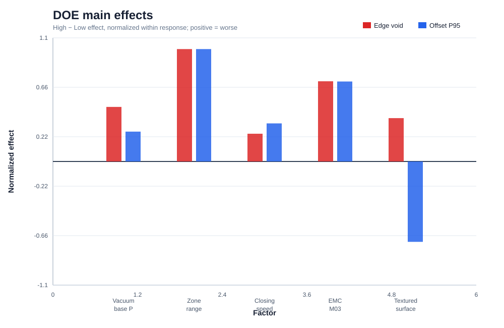
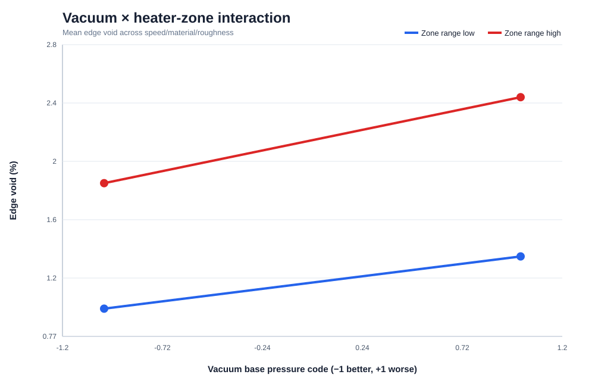
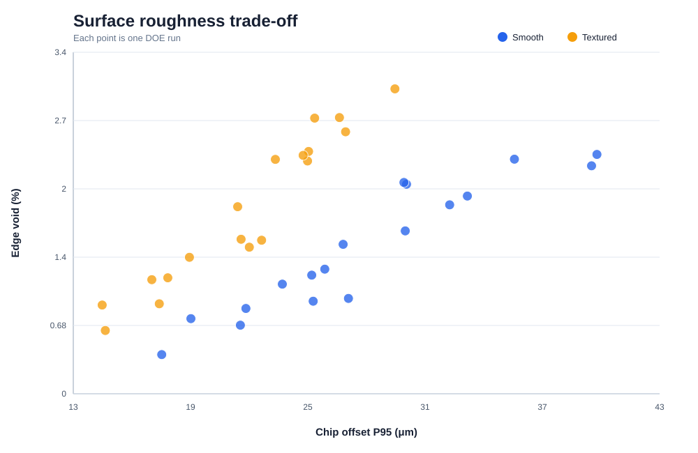
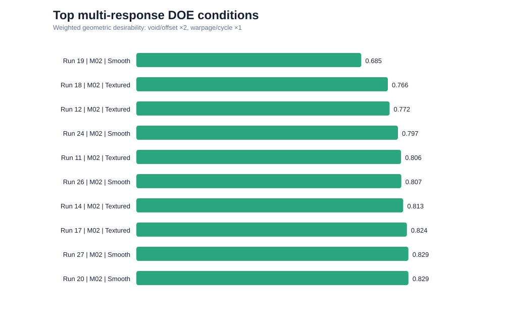

# PROJECT 1 · STEP 4 — Physics-informed DOE 결과

> 본 결과는 문헌이 지지하는 인과 방향을 바탕으로 만든 **synthetic Engineering Scenario**이다. 수치 계수와 최적 recipe는 실제 Fab 조건, 특정 기업의 조건 또는 업계 표준이 아니다.

## 1. 결론부터

36-run split-plot DOE에서 가장 높은 multi-response desirability를 보인 project condition은 다음과 같다.

| Parameter | Selected project condition |
|---|---:|
| EMC lot | M02 |
| Film roughness | Smooth |
| Vacuum base pressure | 4.5 kPa abs |
| Heater zone range | 1.5 °C |
| Closing speed | 0.85 mm/s |
| Overall desirability | 0.829 |

낮은 absolute pressure, 작은 zone 편차, 낮은 closing speed가 process margin을 확보했다. Smooth film은 이 scenario에서 wetting 측면이 유리했고 Textured film은 holding shear를 높여 offset을 낮추는 방향이었으나 void trade-off가 발생했다.

## 2. Figure 9 — DOE Main Effects

**Observation**  
Vacuum base pressure와 heater-zone range가 높아질수록 Edge Void가 증가한다. Closing speed는 void와 offset을 모두 악화시키는 방향이다.

**Engineering Interpretation**  
진공·온도·속도는 독립 knob가 아니라 `M_process = t_gel−t_vac−t_fill`과 flow load를 동시에 바꾼다.

**Next Action**  
Actual waveform이 설정 수준을 재현하는지 확인하고 H1의 A×B interaction을 confirmation run에서 반복한다.

## 3. Figure 10 — Vacuum × Zone Interaction

**Observation**  
Zone range가 큰 조건에서 vacuum base pressure 악화의 void penalty가 더 커진다.

**Engineering Interpretation**  
열경화가 usable flow time을 줄인 상태에서는 evacuation margin 감소에 더 민감해진다는 H1 signature다.

**Next Action**  
Short-shot flow front와 vacuum 완료 시점의 edge temperature를 직접 측정한다.

## 4. Figure 11 — Roughness Trade-off

**Observation**  
Textured surface는 interface shear를 높여 offset을 낮추지만, 높은 contact-angle proxy로 void가 증가하는 trade-off가 있다.

**Engineering Interpretation**  
Ra 증가를 일률적으로 좋거나 나쁘다고 정의할 수 없다. holding, wetting, thermal contact를 함께 관리해야 한다.

**Next Action**  
Ra/Rz–contact angle–die shear 실험으로 synthetic 방향을 검증하고 intermediate roughness center level을 추가한다.

## 5. Figure 12 — Multi-response Window

**Observation**  
Void 단독 최적점과 offset 단독 최적점이 완전히 같지 않으며 side-effect를 포함한 종합점수로 condition을 선택해야 한다.

**Engineering Interpretation**  
양산 recipe 선택은 단일 Y 최소화가 아니라 품질·warpage·takt의 제약 최적화 문제다.

**Next Action**  
상위 3개 condition을 다른 chamber와 material lot에서 confirmation한다.

## 6. Projected Before / After

| Metric | Before synthetic mean | After simulated mean | Change |
|---|---:|---:|---:|
| Edge Void | 1.68% | 0.41% | -75.4% |
| Chip Offset P95 | 40.6 μm | 17.0 μm | -58.0% |
| Warpage | 931 μm | 674 μm | -27.6% |
| Cycle Time Index | 101.7 | 103.8 | 2.1% |

이는 실제 개선 실적이 아니라 **DOE 결과로부터 생성한 simulated confirmation**이다. 자기소개서에는 “개선했다”가 아니라 “개선 가능성을 정량 검증했다”로 표현한다.

## 7. Root Cause Update

- H1 Thermo-rheology × evacuation margin: synthetic DOE에서 interaction 재현 → **Strong**
- H2 Vacuum/Vent equipment: 실제 leak/PM split 미실시 → **Medium-Strong 유지**
- H3 Roughness/Wetting/Adhesion: response trade-off 재현, 실측 coupon 미실시 → **Medium**
- H4 Tension/Parallelism: reversal test 미실시 → **Weak-Medium**
- H5 EMC rheology: material whole-plot effect 존재, whole plot 수가 적음 → **Medium**
- H6 Measurement: repeatability study 전 → **Unverified**

## 8. 통계 해석 주의

EMC와 roughness는 hard-to-change whole-plot factor이며 whole plot이 4개뿐이다. 따라서 해당 계수의 p-value를 강한 인과 증거로 사용하지 않는다. Process factor effect와 physical signature를 우선하고, material/roughness는 추가 whole-plot replicate로 검증한다.
