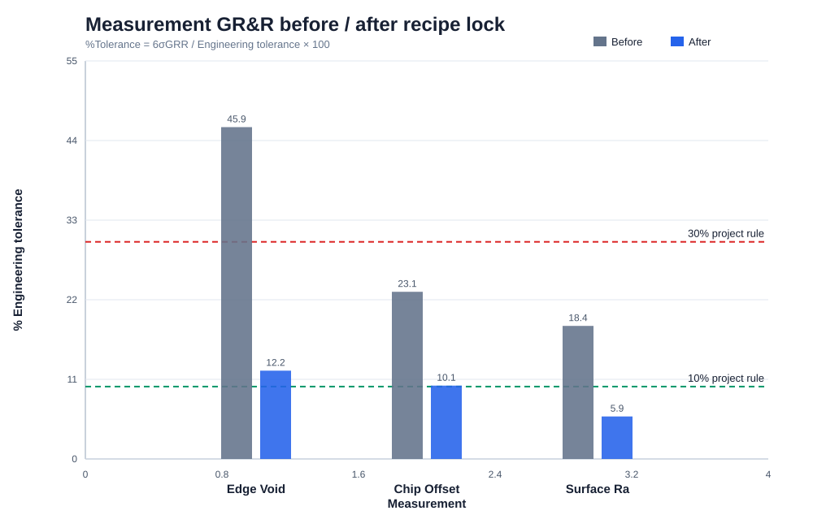
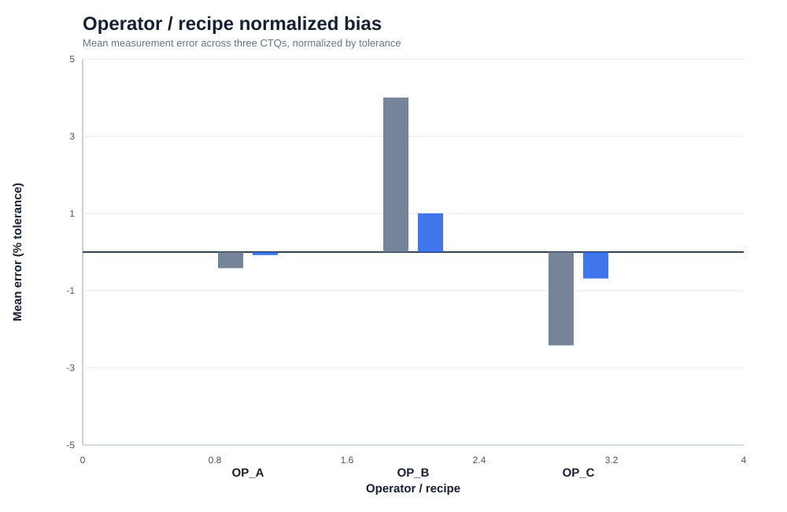
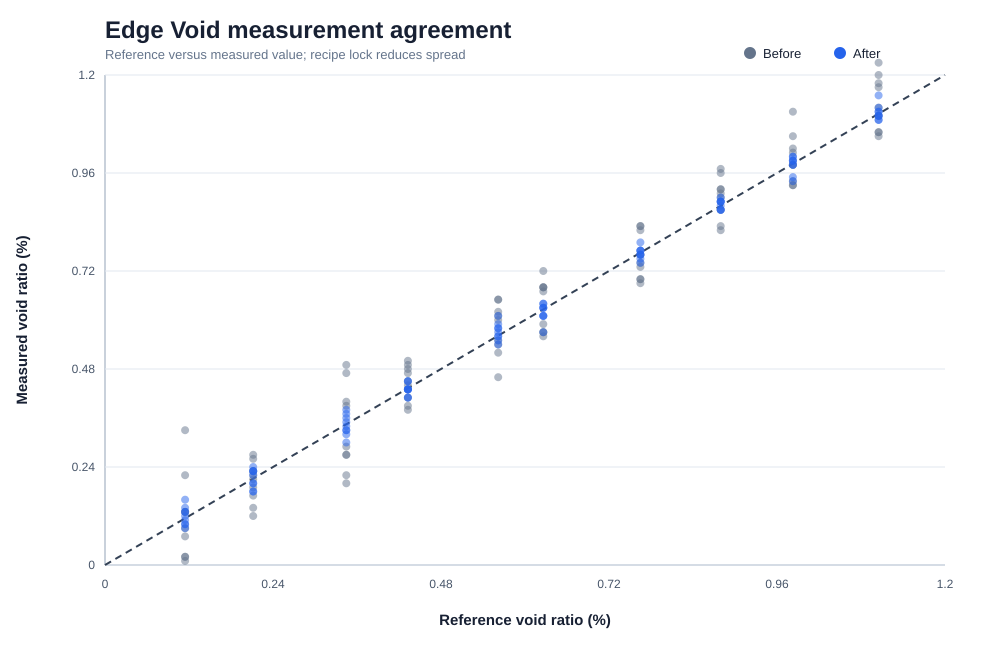

# PROJECT 1 · STEP 5 — Measurement System Analysis

> 본 MSA 데이터는 검사 recipe 표준화 효과를 검토하기 위한 synthetic Engineering Scenario다. 실제 장비 capability 결과가 아니다.

## 1. Study Design

- 10 reference samples spanning the intended process range
- 3 operators/measurement recipes
- 3 repeats per part–operator cell
- Crossed two-way ANOVA Gauge R&R
- 대상: Edge Void(SAM/image threshold), Chip Offset(coordinate registration), Surface Ra(profilometer)

NIST는 생산 측정시스템의 repeatability, reproducibility, stability, bias, resolution과 configuration 차이를 함께 평가하도록 설명한다. 본 프로젝트는 이를 따라 operator/recipe와 repeat variance를 분리한다. [NIST Gauge R&R guidance](https://www.itl.nist.gov/div898/handbook/mpc/section4/mpc4.htm)

## 2. Variance Component Model

`y_ijk = μ + Part_i + Operator_j + (Part×Operator)_ij + ε_ijk`

`σ²_GRR = σ²_repeat + σ²_operator + σ²_part×operator`

`%Tolerance = 100 × 6σ_GRR / (USL−LSL)`

`ndc = floor(1.41 σ_part / σ_GRR)`

Resolution `δ`의 표준불확도 screening은 NIST 식 `u_resolution = δ/√3`을 사용했다. [NIST uncertainty from gauge study](https://www.itl.nist.gov/div898/handbook/mpc/section4/mpc46.htm)

`<10% Capable`, `10–30% Conditional`, `>30% Not capable`은 본 portfolio의 project decision rule이며 보편적 합격 규격으로 주장하지 않는다.

## 3. Result

| Measurement | Before %Tolerance | After %Tolerance | After ndc | Project decision |
|---|---:|---:|---:|---|
| Edge Void | 45.9% | 12.2% | 22 | Conditional |
| Chip Offset | 23.1% | 10.1% | 25 | Conditional |
| Surface Ra | 18.4% | 5.9% | 48 | Capable |

## 4. Figure 13 — GR&R Before/After

**Observation**  
Recipe lock 이후 세 측정의 %Tolerance가 모두 감소한다. 개선 전 Edge Void는 operator threshold와 repeat scan 변동의 영향이 가장 크다.

**Engineering Interpretation**  
SAM/image void는 실제 기공 변화 외에도 gain, threshold, edge segmentation과 operator 판정에 민감할 수 있다. 공정 DOE 전에 검사 recipe를 잠그지 않으면 vacuum/roughness effect가 과대 또는 과소 추정될 수 있다.

**Next Action**  
분석 데이터 생성 시 golden sample, fixed gain/threshold, edge ROI definition과 blind repeat scan 조건을 기록한다.

## 5. Figure 14 — Operator/Recipe Bias

**Observation**  
표준화 전 operator/recipe 평균 편차가 존재하며 recipe lock 후 축소된다.

**Engineering Interpretation**  
Reproducibility 문제는 장비 sensor noise만의 문제가 아니라 좌표정합, ROI 선택, stylus direction 등 measurement method 차이일 수 있다.

**Next Action**  
포트폴리오 실험에서는 동일 sample을 operator/recipe별로 재측정해 bias가 축소되었는지만 확인한다.

## 6. Figure 15 — Edge Void Measurement Agreement

**Observation**  
Recipe lock 전에는 reference line 주위 산포와 operator별 offset이 크고, 이후 축소된다.

**Engineering Interpretation**  
공정 산포와 측정 산포의 분리가 개선되어 DOE의 effect size를 더 신뢰할 수 있다.

**Next Action**  
Low/medium/high void reference sample이 있어야 range 전체의 linearity와 분석 시점 간 drift를 구분할 수 있음을 한계로 기록한다.

## 7. Reference와 Requalification이 필요한 이유

- **Reference sample:** 동일한 물체를 다시 측정했을 때 결과가 변하면 공정 변화가 아니라 측정 drift일 가능성을 확인할 수 있다. 또한 low/medium/high range의 reference가 있어야 bias와 linearity를 구분할 수 있다.
- **Requalification:** Tool, software, threshold, coordinate algorithm 또는 profilometer 조건을 바꾼 뒤에도 이전 데이터와 같은 기준으로 비교할 수 있는지 확인하는 절차다.

현재는 양산 단계가 아니므로 관리 주기, warning limit, lot hold와 같은 운영 기준은 설계하지 않는다. 포트폴리오에서는 **측정 조건이 바뀌면 전후 데이터를 바로 비교할 수 없다는 이유**만 명시한다.

## 8. Decision

DOE/optimization에는 **After recipe lock** 측정시스템만 사용한다. 본 crossed study는 단기 repeatability와 operator/recipe reproducibility만 다루며 장기 stability는 범위 밖이다. 향후 실제 장비 데이터를 사용할 경우 reference와 requalification이 필요한 이유를 위와 같이 남긴다.
