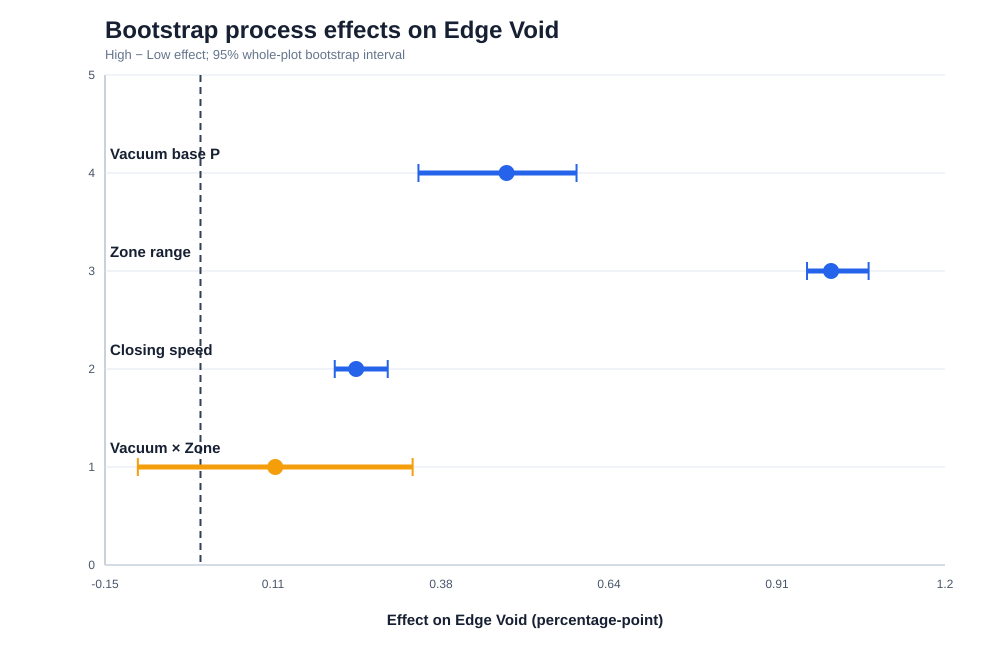

# PROJECT 1 · STEP 6 — Root Cause Verification & Robust Process Window

> 모든 수치와 Root Cause 판정은 synthetic Engineering Scenario 내부의 결과다. 실제 Fab Root Cause 또는 특정 기업의 공정 조건으로 표현하지 않는다.

## 1. 최종 판단

현재 가장 강한 설명은 **열–유동–경화 margin 감소**다. Vacuum base pressure 악화와 heater-zone range 증가는 Edge Void를 증가시켰다. 두 요인의 interaction 평균도 악화 방향이었지만 bootstrap 95% CI가 0을 포함해 안정적인 effect로 확정하지 않는다. Closing speed는 void보다 chip drag/offset에 더 직접적인 영향을 보였다.

다만 원인 판정 범위는 다음처럼 제한한다.

- H1: synthetic DOE에서 조작·재현됨 → Strong
- H2: chamber/time/PM signature는 있으나 vent를 직접 조작하지 않음 → Medium-Strong
- H3/H5: whole-plot 반복 부족 → causal confirmation 불가
- H4: 현재 DOE에서 미조작 → open hypothesis
- H6: recipe lock으로 confounding 감소, 완전 제거는 아님

## 2. Bootstrap Effect

**Observation**  
Edge Void high-minus-low effect는 Vacuum 0.48, Zone range 0.99, A×B 0.12 percentage-point다. A×B의 bootstrap 95% CI는 -0.10–0.33로 0을 포함한다. 각 effect는 4개 whole plot 내부 contrast에서 계산했다.

**Engineering Interpretation**  
Zone range가 가장 큰 process lever이며 vacuum 악화와 결합하면 margin penalty가 커진다. 단, whole plot 수가 4개뿐이므로 CI는 탐색적이다.

**Next Action**  
실제 검증에서는 material/chamber block을 추가하고 같은 contrast 방향이 재현되는지 확인한다.

## 3. MSA-guarded Robust Process Window

Robust pass 조건은 다음과 같다.

- `Predicted Void + 3σ_GRR ≤ 0.50%`
- `Predicted Offset + 3σ_GRR ≤ 20 μm`
- `Warpage ≤ 750 μm`
- `Cycle Time Index ≤ 105`

M02/Smooth 조합의 탐색 grid 567개 중 3개가 robust pass다. 단순 범위로 표현하면 vacuum 4.50–4.75 kPa abs, zone range 1.50–1.50°C, closing speed 0.85–0.90 mm/s다.

**주의:** 이 min/max를 독립 허용범위로 조합하면 안 된다. Interaction 때문에 반드시 Figure와 `robust_process_window.csv`의 동시 조합을 사용한다.

**Observation**  
낮은 zone range와 낮은 absolute vacuum pressure 쪽에 robust region이 형성된다. Closing speed가 높아지면 offset guard band가 먼저 사라진다.

**Engineering Interpretation**  
Average optimum보다 measurement uncertainty를 포함한 공정창이 더 좁다. 이는 MSA를 recipe 판단에 반영한 결과다.

**Next Action**  
실제 장비에서는 selected window의 center와 boundary에서 confirmation run을 수행한다.

## 4. Root Cause Evidence Ladder

**Observation**  
H1만 조작 DOE evidence를 갖고, H2는 associative, H3~H5는 제한된 evidence다.

**Engineering Interpretation**  
물리적으로 그럴듯하다는 사실과 실험으로 원인을 규명했다는 주장을 분리해야 한다.

**Next Action**  
포트폴리오에서는 H1을 주원인, H2를 설비 악화요인, H3/H5를 modifier, H4를 배제되지 않은 대안으로 표현한다.

## 5. 최종 Root Cause Statement

> 본 synthetic project에서 Edge Void의 주원인은 heater-zone 불균일과 vacuum evacuation margin 감소가 EMC의 usable flow window를 축소한 것이다. 같은 조건에서 증가한 pressure/viscous load가 chip offset을 악화시켰다. Vacuum/Vent 열화는 이 margin을 악화시키는 설비 요인으로 지지되었지만 직접 split test는 수행하지 않았다. EMC 소재와 surface roughness는 rheology, wetting과 holding force를 바꾸는 modifier이며 whole-plot 반복 부족으로 독립 root cause로 확정하지 않았다. Measurement recipe lock을 통해 측정기인 confounding은 줄였다.

## 6. 면접에서 지켜야 할 표현

- 가능: “Synthetic DOE에서 H1 interaction을 재현하고 robust process window를 도출했다.”
- 가능: “H2는 설비 signature가 있었지만 직접 조작하지 않아 원인 확정을 보류했다.”
- 금지: “실제 Fab의 edge void를 75% 개선했다.”
- 금지: “표면거칠기가 원인임을 증명했다.”
