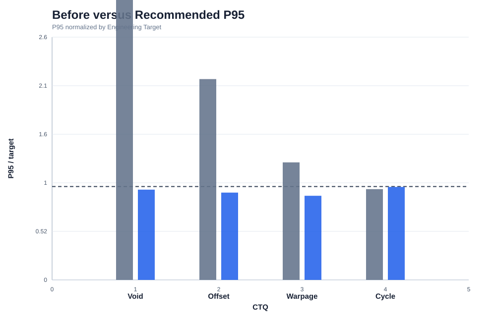
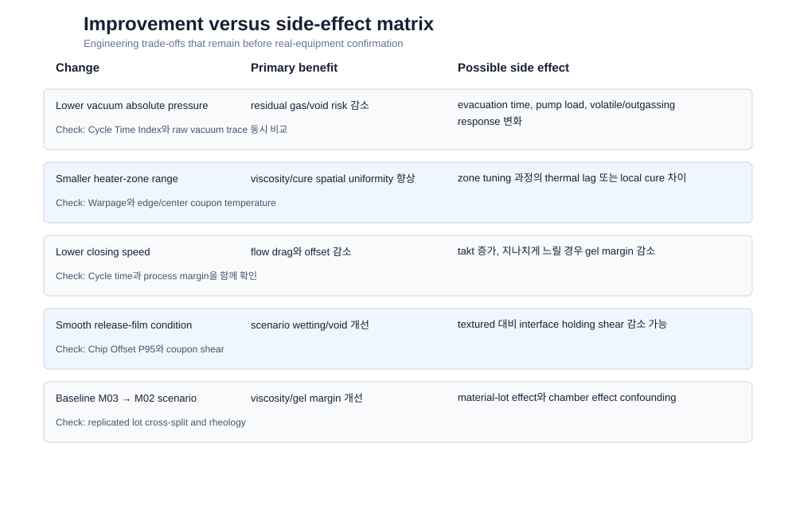

# PROJECT 1 · STEP 7 — Improvement Confirmation, Side Effect & Control Concept

> 모든 결과는 12회 반복 synthetic Engineering Scenario다. 실제 생산 개선 실적이나 양산 관리 기준이 아니다.

## 1. Confirmation Result

| Condition | Edge Void mean | Offset P95 mean | Warpage mean | Cycle Index mean | All-CTQ pass rate |
|---|---:|---:|---:|---:|---:|
| Baseline | 1.77% | 41.1 μm | 925 μm | 101.6 | 0% |
| Recommended | 0.40% | 16.7 μm | 656 μm | 104.1 | 100% |
| Vacuum boundary | 0.41% | 17.2 μm | 659 μm | 103.6 | 100% |
| Speed boundary | 0.38% | 17.6 μm | 662 μm | 103.4 | 100% |
| Zone outside | 0.45% | 18.5 μm | 673 μm | 104.1 | 92% |

## 2. Figure 19 — Confirmation Comparison

**Observation**  
Recommended condition은 네 CTQ 평균이 Engineering Target 안에 들어온다. Boundary condition은 평균은 만족할 수 있어도 반복 산포를 포함한 all-CTQ pass rate가 낮아질 수 있다.

**Engineering Interpretation**  
최적점 하나보다 boundary challenge를 함께 보여야 공정창의 guard band를 설명할 수 있다.

**Next Action**  
실제 데이터 확보 시 center와 각 boundary를 material/chamber block으로 반복한다.

## 3. Figure 20 — Before/Recommended P95

**Observation**  
Recommended condition은 mean뿐 아니라 P95 기준에서도 개선 방향을 유지한다.

**Engineering Interpretation**  
평균 개선만으로 tail risk가 가려지는 문제를 피했다.

**Next Action**  
실제 portfolio 발표에서는 mean, standard deviation, P95를 함께 제시한다.

## 4. Side Effect Matrix

핵심 trade-off는 다음과 같다.

- 강한 vacuum: void 개선 ↔ evacuation time/pump load 가능성
- 느린 closing: offset 감소 ↔ takt 증가 및 지나치게 느릴 때 gel margin 감소
- smooth surface: wetting 개선 가능성 ↔ holding shear 감소 가능성
- thermal uniformity 개선: warpage 개선 가능성 ↔ local temperature 검증 필요

자세한 내용은 `results/side_effect_matrix.csv`에 저장한다.

## 5. Portfolio-level Control Concept

현재는 양산 단계가 아니므로 Sampling Frequency, Warning Limit, OCAP 수치를 만들지 않는다. 대신 다음만 정의한다.

1. 무엇을 볼 것인가: Edge Void, Offset, Warpage, Cycle Time, actual vacuum, zone range, actual speed, material/surface genealogy
2. 왜 볼 것인가: 어떤 물리 mechanism과 Root Cause claim을 확인하는지
3. 어떤 데이터가 추가로 필요한가: 실제 sensor accuracy, product spec, chamber/material replicate
4. Reference/requalification이 필요한 이유: measurement drift와 process change를 구분하고 조건 변경 전후 비교 가능성을 확보하기 위해

전체 항목은 `results/control_concept.csv`에 정리한다.

## 6. Improvement Statement

> Synthetic confirmation에서 M02/Smooth, vacuum 4.5 kPa abs, zone range 1.5°C, closing speed 0.85 mm/s 후보는 baseline 대비 Edge Void와 Chip Offset을 동시에 낮추고 Warpage Target을 만족했다. Cycle Time은 증가 방향이어서 단일 품질 최적점이 아닌 다중 CTQ 조건으로 선택했다. Boundary 반복에서는 guard band가 줄어드는 것을 확인해 평균 optimum보다 robust process window를 최종 개선안으로 제시했다.

## 7. Claim Boundary

- 가능한 주장: “물리 기반 synthetic DOE와 confirmation으로 개선 후보와 side effect를 정량 비교했다.”
- 불가능한 주장: “실제 양산 수율을 개선했고 Control Limit을 확정했다.”
