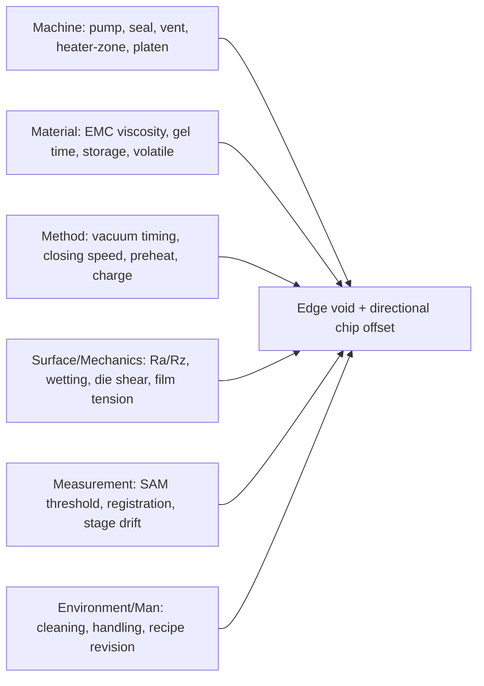
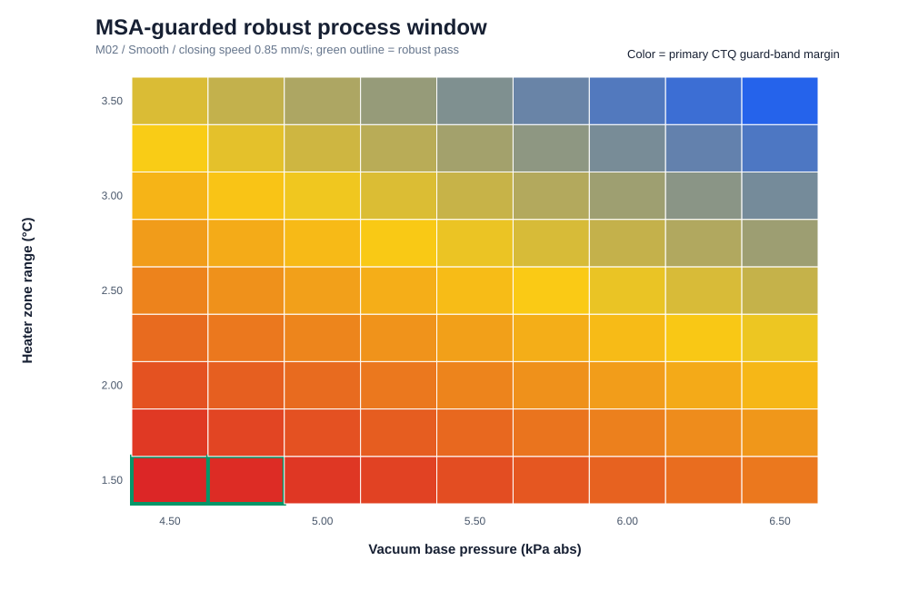
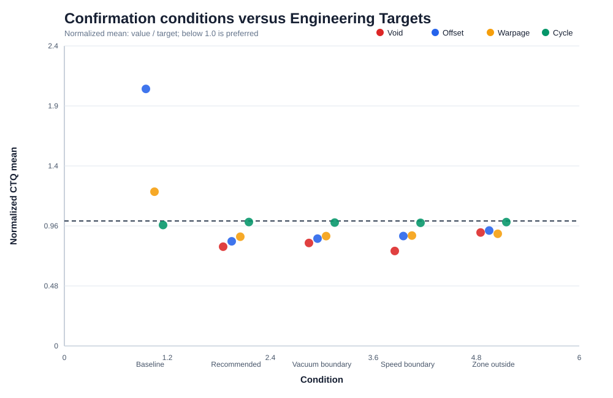

# PROJECT 1 — Compression Molding Edge Void & Chip Offset A3

> Portfolio conclusion: **열–유동–경화 margin을 주원인 가설로, vacuum/vent를 설비 악화요인으로 좁혔다. 표면거칠기는 wetting과 holding의 trade-off를 만드는 modifier로 남겼다.** 모든 수치와 결론은 physics-informed synthetic engineering scenario에 한정된다.

## 1. Problem and CTQ

Compression molding 후 wafer outer edge에 void가 집중되고 chip offset vector가 random이 아닌 radial/한쪽 방향으로 정렬되는 현상을 문제로 정의했다. 단순히 “진공이 부족했다”라고 결론 내리지 않고 공정·설비·소재·표면·측정 원인을 경쟁시켰다.

| CTQ | Baseline scenario | Engineering target | 역할 |
|---|---:|---:|---|
| Edge Void Area Ratio | 1.8% | ≤ 0.50% | 대표 Y |
| Chip Offset P95 | 42 μm | ≤ 20 μm | 동시 Primary CTQ |
| Warpage P95 | 920 μm | ≤ 750 μm | 기계적 side effect |
| Cycle Time Index | 100 | ≤ 105 | 생산성 side effect |

위 기준은 실제 양산 spec이나 업계 표준이 아닌 **본 프로젝트 분석용 Engineering Target**이다.

## 2. Process and failure mechanism

핵심은 진공, 충전, gel이 서로 독립이 아니라 시간 경쟁을 한다는 점이다.

`M_process = t_gel − t_vac − t_fill`

- `M_process`가 작아지면 flow front가 vent path를 닫기 전에 기체를 충분히 배출할 여유가 줄어든다.
- 온도 상승은 초기 점도를 낮추지만 cure를 가속해 gel 시간을 줄이므로 “고온일수록 항상 유리”하지 않다.
- gap `h`가 작아지고 반경 `r`이 커질수록 축대칭 mass balance에서 radial velocity가 커진다: `V_radial = (r/2h)V_close`.
- die에 작용하는 유동하중은 `F_flow = ∫A(−pn + τ)dA`이며, 본 프로젝트는 shift screening에 아래 힘 평형을 사용했다.

`SF_shift = F_hold / (F_drag + F_film + F_pressure_asymmetry)`

두 식은 문헌 표준식이 아니라 문헌의 열경화 kinetics·점도·유동 mechanics를 결합해 만든 **프로젝트용 engineering KPI**다. 실제 사용 전 calibration이 필요하다.

## 3. Fishbone and competing hypotheses

| 우선순위 | 원인 후보 | 물리 메커니즘 | 판별 signature / 실험 | 개선 시도 |
|---|---|---|---|---|
| **추천 H1** | 열–유동–경화 × evacuation margin | zone 불균일·조기 gel이 충전/배기창을 축소하고 비대칭 pressure/shear가 die를 이동 | short-shot, zone×vacuum×speed DOE, vector map | zone matching, vacuum-ready interlock, staged closing |
| H2 | Vacuum/Vent 설비 열화 | leak·vent 막힘·pump conductance 저하로 잔류 기체와 압력 비대칭 증가 | chamber swap, leak-up/pump-down, PM 전후 split | vent/seal/pump isolation, actual-trace 기준 확인 |
| H3 | 표면거칠기·젖음·holding | roughness가 real area·contact angle·valley gas·die shear를 동시에 변화 | Ra/Rz/texture, contact angle, coupon shear, thermal coupon | 단일 Ra가 아닌 surface window와 cleaning 조건 탐색 |
| H4 | Release-film tension/platen | film 방향 하중·평행도 오차가 offset 방향성을 설비좌표에 고정 | film MD/TD 좌표, tension split, platen map | tension matching, platen leveling |
| H5 | EMC lot/storage history | viscosity·gel time·moisture/volatile 변화가 flow window를 이동 | material-lot crossover, DSC/DEA/rheology proxy | genealogy, exposure 관리, lot hold/split |
| H6 | 측정 recipe | SAM threshold·registration drift가 edge void/offset을 과대평가 | blind rescan, recipe lock, reference artifact | threshold/registration 고정과 bias 확인 |

## 4. Surface roughness interpretation

거칠기를 “클수록 좋다/나쁘다”로 단정하지 않았다.

- 완전 젖음의 이상적 Wenzel 상태에서는 `cosθ* = r cosθY`로 apparent wetting이 달라질 수 있다.
- valley가 기체 통로를 만들거나 불완전 wetting을 유도하면 `ΔPcap ≈ 2γcosθ/r_pore`와 계면 형상에 따라 미세 void가 증가할 수 있다.
- roughness는 mechanical interlocking을 높일 수 있지만 real contact loss와 stress concentration도 만들 수 있다.
- 표면/필름 계면이 열경계 조건을 바꾸면 package가 경험한 실제 온도가 heater setting과 달라질 수 있다.

따라서 `Ra` 하나와 defect의 상관만 보지 않고 **Ra/Rz/texture + contact angle + die shear + local ΔT + failure mode**를 같은 coupon에서 측정해야 한다. 현재 synthetic DOE에서 표면 조건은 whole-plot 반복이 부족하므로 독립 root cause로 확정하지 않았다.

## 5. Measurement gate

“보이는 산포가 공정 산포인가?”를 먼저 확인했다. Recipe lock 후 간이 MSA에서 Edge Void %Tolerance 12.2%, Offset 10.1%, Surface Ra 5.9%가 나왔다. Surface Ra는 capable, 앞의 두 CTQ는 조건부 사용으로 판단했고, 최적점 대신 측정 불확도를 포함했다.

Robust pass gate:

- `Predicted Void + 3σ_GRR ≤ 0.50%`
- `Predicted Offset + 3σ_GRR ≤ 20 μm`
- `Warpage ≤ 750 μm`
- `Cycle Time Index ≤ 105`

## 6. Analysis and root-cause decision

DOE의 high-minus-low Edge Void effect는 vacuum +0.48%p, zone range +0.99%p, closing speed +0.24%p였다. Vacuum×zone 평균 interaction은 +0.12%p였지만 bootstrap 95% CI `−0.10–0.33%p`로 0을 포함했다. 따라서 interaction 방향은 공학적으로 설명 가능하지만 **통계적으로 안정된 효과로 확정하지 않았다**.

| Hypothesis | Evidence | 판단 |
|---|---|---|
| H1 thermo-rheology × evacuation margin | **Strong** | synthetic DOE에서 조작·재현됨 |
| H2 vacuum/vent equipment | **Medium–Strong** | chamber/time/PM signature, 직접 split 미수행 |
| H3 surface roughness/wetting/holding | **Medium** | trade-off 관측, whole-plot/coupon 반복 필요 |
| H4 film tension/platen | **Weak–Medium** | 물리적으로 가능하나 현 DOE에서 미조작 |
| H5 EMC rheology/history | **Medium** | genealogy signature, 독립 반복 부족 |
| H6 measurement confounding | 감소 | recipe lock으로 완화, 완전 제거 아님 |

최종 원인 문장:

> 본 synthetic scenario에서 heater-zone 불균일과 vacuum evacuation margin 감소가 EMC usable flow window를 축소해 edge void를 증가시켰고, 같은 조건의 pressure/viscous load가 chip offset을 악화시켰다. Vacuum/vent 열화는 설비 악화요인으로 지지되지만 직접 split 전에는 원인 확정을 보류한다. 표면거칠기와 EMC 이력은 wetting·holding·rheology를 바꾸는 modifier다.

## 7. Improvement and robust window

M02/Smooth 567개 grid 조합 중 MSA +3σ gate를 모두 만족한 조합은 3개뿐이었다.

| Vacuum (kPa abs) | Zone range (°C) | Closing speed (mm/s) |
|---:|---:|---:|
| 4.50 | 1.50 | 0.85 |
| 4.50 | 1.50 | 0.90 |
| 4.75 | 1.50 | 0.85 |

선정 후보는 `4.50 / 1.50 / 0.85`다. 이 숫자는 production recipe가 아니라 project scenario 조건이며 min/max를 독립 조합 가능한 허용범위로 해석하면 안 된다.

## 8. Confirmation and side effects

| Condition | Edge Void | Offset P95 | Warpage | Cycle Index | All-CTQ pass |
|---|---:|---:|---:|---:|---:|
| Baseline | 1.77% | 41.1 μm | 925 μm | 101.6 | 0% |
| Recommended | 0.40% | 16.7 μm | 656 μm | 104.1 | 100% |
| Zone outside | 0.45% | 18.5 μm | 673 μm | 104.1 | 91.7% |

12회 synthetic confirmation에서는 평균과 P95가 함께 개선됐지만, 실제 수율 개선 실적으로 표현하지 않는다.

주요 trade-off:

- 더 강한 vacuum: void 감소 ↔ evacuation time·pump load 가능성
- 더 느린 closing: drag/offset 감소 ↔ takt 증가·gel margin 감소 가능성
- smooth surface: wetting 개선 가능성 ↔ holding shear 감소 가능성
- zone uniformity: flow/warpage 개선 가능성 ↔ local cure 상태 확인 필요

## 9. Control concept, reference and requalification

아직 양산 단계가 아니므로 sampling frequency, warning/control limit, OCAP 숫자를 임의로 만들지 않았다. 실제 전환 시에는 Edge Void, Offset, Warpage, Cycle Time과 actual vacuum/zone range/speed, EMC 및 surface genealogy를 연결해 봐야 한다.

- **Reference가 필요한 이유:** 측정 recipe·장비 drift와 실제 공정 변화를 구분하고, 동일 기준으로 변경 전후를 비교하기 위해서다.
- **Requalification이 필요한 이유:** material, chamber PM, surface/film, recipe 변경이 기존의 열–유동–경화 및 holding balance를 바꾸므로 기존 robust window가 여전히 유효한지 확인하기 위해서다.

## 10. Limitations and next real-data request

- 실제 Fab 데이터·제품 spec·장비 capability를 사용하지 않았다.
- material/chamber whole-plot replicate가 적어 H2·H3·H5의 독립 인과를 확정할 수 없다.
- cure/rheology/thermal-contact 계수는 실측 material constant가 아니다.
- 실제 첫 요청 데이터는 동일 timestamp/wafer ID로 연결된 `zone별 temperature + vacuum/pressure/position raw waveform + material/PM genealogy + die별 pre/post coordinate + void map`이다.
- 이후 chamber×material crossover, leak/vent PM split, surface coupon 시험과 center/boundary confirmation을 수행한다.

## 11. Evidence and reproducibility

- [물리식·논문 근거](04_engineering_literature_basis.md)
- [EDA findings](02_eda_findings.md)
- [DOE results](04_doe_results.md)
- [MSA](05_measurement_system_analysis.md)
- [Root-cause verification](06_root_cause_verification.md)
- [Confirmation and control concept](07_improvement_verification_control_concept.md)
- [Data provenance](../data/DATA_SOURCES.md)
- [Notebooks](../notebooks/)

